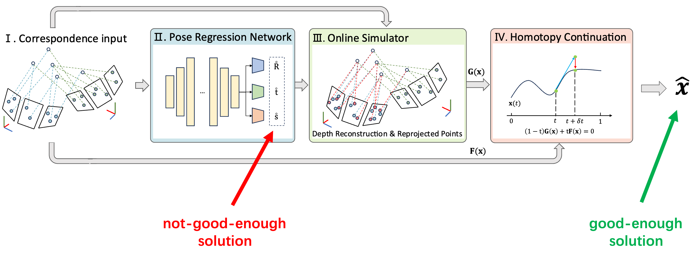

<p align="center">
  <h1 align="left">Simulator HC <br> <font size="4">Regression-based Online Simulation of Starting Problem-Solution Pairs for Homotopy Continuation in Geometric Vision</font></h1>
  <h3 align="center">CVPR 2025 (Highlight) |<a href="https://arxiv.org/abs/2411.03745"> Paper</a> </h3>
  <div align="center"></div>
</p>

<p align="center">
  <a href="">
    
  </a>
</p>

<p align="left">
<strong>Overview: We propose simulatorHC, a novel regressor-simulator paradigm for geometric vision problems. It enables homotopy continuation to efficiently track only one solution path, leading to high efficiency and high success rate.
</strong>
</p>

# Citation

```bibtex
@article{zhang2024homotopy,
  title={Homotopy Continuation Made Easy: Regression-based Online Simulation of Starting Problem-Solution Pairs},
  author={Zhang, Xinyue and Dai, Zijia and Xu, Wanting and Kneip, Laurent},
  journal={arXiv preprint arXiv:2411.03745},
  year={2024}
}
```

# Installation

To start with, install the python environment and activate it.
```bash
conda env create -f environment.yml
conda activate HC
```
Then install simulatorHC, remember to have cpp compiler, cmake and [intel mkl toolkit](https://www.intel.com/content/www/us/en/developer/tools/oneapi/onemkl.html#gs.m774j7) installed.
```bash
pip install -e .
```

# Run simulatorHC on Generalized Absolute Pose
```python
# train the regressor
python simulatorHC/GeneralizedAbsolutePose/train.py
# run simulator HC with trained regressor
python simulatorHC/GeneralizedAbsolutePose/evaluate.py
```

# Run simulatorHC on Generalized Relative Pose and Scale
```python
# train the regressor
python simulatorHC/GeneralizedRelativePoseAndScale/train.py
# run simulator HC with trained regressor
python simulatorHC/GeneralizedRelativePoseAndScale/evaluate.py
```


